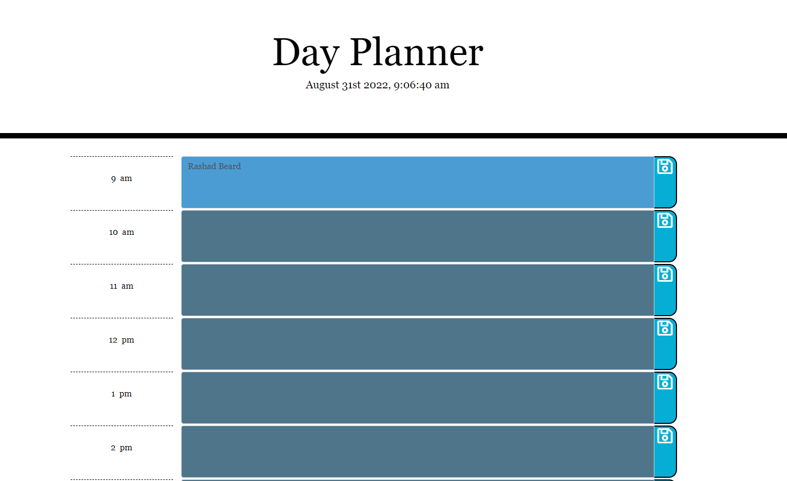

# Day-Planner
=======
# Edward Beard

## Purpose
The purpose of this site is for you to have the ability to plan your workday by the hour. 

## Built With
* HTML
* CSS
* Javascript
* jQuery

## Features
This webisite was developed with the following features:

* This application displays the standard business hours (9 a.m. to 5 p.m.). Each time slot represents one hour and contains: Time, Field for User Input, & Save Button
* Clicking the Save Button stores the user input in Local Storage.

* The top of the calendar displays the current date & time. 

* Each hour is color coeded to represent the current time slot is in the past, present (UNC Blue), or future (navy blue). This changes depends on the time of day.

## Website
https://erbeard.github.io/day-planner/

## Contribution
Made with ❤️ by Edward Beard